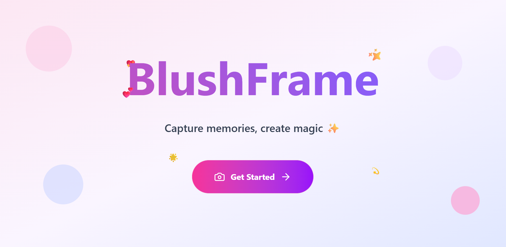
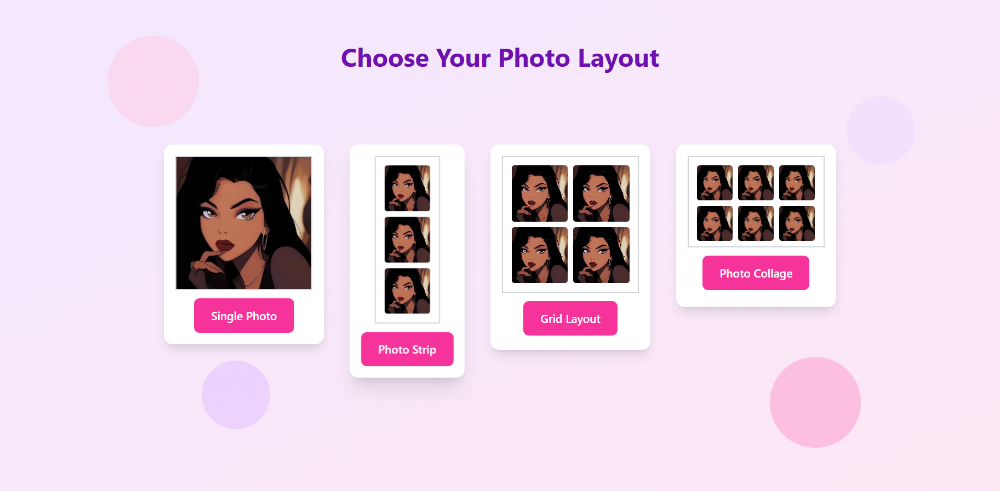

# BlushFrame
**BlushFrame** is a fun digital photo booth I built. Capture pictures, add stickers, choose layouts, and make your photos look magical! ✨💖  

## Features

- ✨ **Stickers & Effects** - Decorate your photos with fun stickers and effects.  
- 💖 **Multiple Layouts** - Customize how your photos are displayed.  
- 📸 **Instant Keepsakes** - Save screenshots and share your favorite moments.  

## Tech Used

- **React** - Frontend  
- **Tailwind CSS** - Styling  
- **React Router** - Page navigation  
- **Lucide Icons** - Fun icons and effects

## Future Plans

- 💾 Enable **real photo download functionality**  
- 🎨 Add more **filters, frames, and layouts**  
- 📤 Integrate **social sharing** options  
- ✨ Introduce **animated sticker packs** and seasonal themes  
 
## Here’s a glimpse of BlushFrame:

